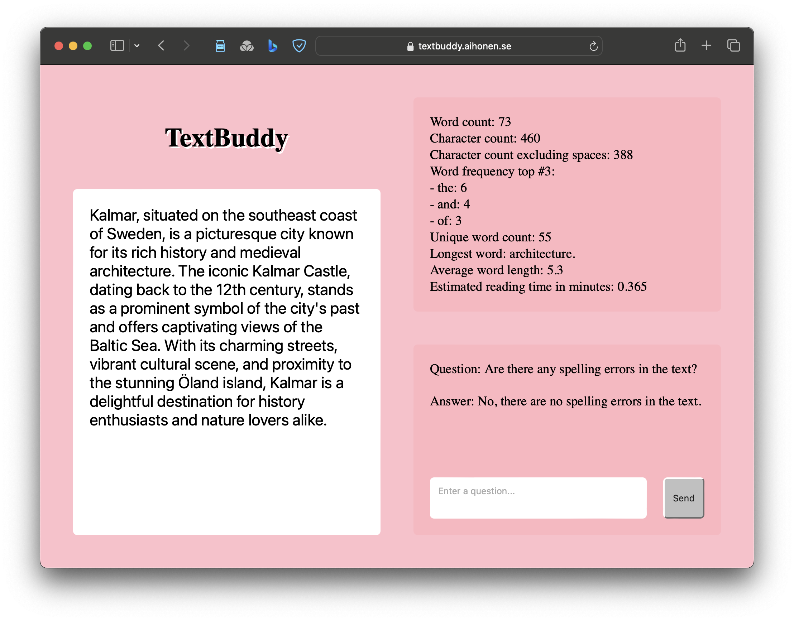

# TextBuddy
TextBuddy is a text analyser application that works directly in your browser. It is available for free on [textbuddy.aihonen.se](https://textbuddy.aihonen.se). 

## Vision
TextBuddy aims to be your go to text analyser to find statistics and help you understand your texts. It should provide data fast and is powered by ai to unlock even more insights.

TextBuddy can be used by students, professionals and anyone who works with text on a desktop or laptop and needs to find out more information about their text. 

Does your next assignment have a minimum word length? Use TextBuddy to make sure that you fullfil the requirements!

## Features
- Available as a web application
- Built for desktops and large screens
- Analyse your text in real time, get updated analytics  directly when the text is updated:
    - Word count
    - Character count
    - Character count excluding spaces
    - Word frequency top #3
    - Unique word count
    - Longest word
    - Average word length
    - Estimated reading
- Supports the power of OpenAi's API with an OpenAi APi key.
- Textbuddy is powered by the the [textbuddy javascript module](https://github.com/ta223dh/TextBuddy) and aims to always use the latest version of the module.

## Roadmap
You can find the planned development and development in progress in the issue list. The list is open for anyone to add feature suggestions or bugs.

See [Issues](https://github.com/ta223dh/TextBuddy-Application/issues)

## Test reports
See [test reports](testrapport.md)

## Version history
See [version history](https://github.com/ta223dh/TextBuddy-Application/releases/)

## For developers
Feel free to clone and contribute to the project, or integrate the code into your own solution.

To get started:
- `git clone` the project repo to your local folder
- `cd TextBuddy-Application` to navigage into the folder
- `npm install` to set up the project
- `npm run dev` to run on localhost
- `code .` to open the project in your code editor
- Check lint issues: `npm run lint`
- Automatically fix lint issues (if possible): `npm run lint:fix`
